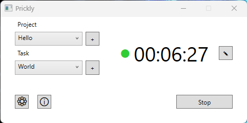

# Prickly
Prickly is a simple app for time tracking. It allows you to track time spent on different tasks and projects. It has auto-pause feature, so you don't have to worry about forgetting to pause the timer when you're not working.

It was created as a project for the course [Introduction to C#/.NET](https://is.muni.cz/course/fi/spring2024/PV178) at [MUNI FI](https://www.fi.muni.cz/index.html.en).

## Requirements
- .NET 8 Desktop runtime must be installed on the target Windows PC.
- The app stores its local config and database in `%LOCALAPPDATA%\PricklyApp` so it can run without administrator privileges.

## NuGets
- [LiteDB](https://www.litedb.org)
- [MouseKeyHook](https://github.com/gmamaladze/globalmousekeyhook)
